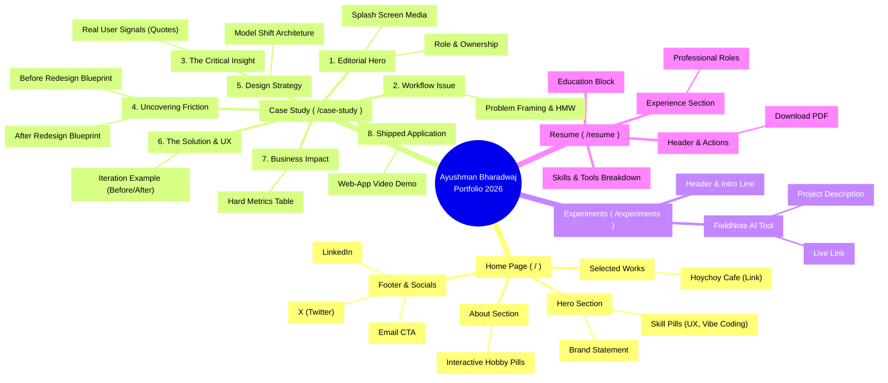

# Ayushman Bharadwaj — Portfolio Information Architecture (IA)

Below is the comprehensive Information Architecture diagram outlining the structure of the 2026 UX Portfolio. It visualizes the top-level routes, page sections, and the specific narrative flow of the deep-dive UX case study.

## Navigation Flow
- **Global Pill Navigation:** Accessible from all routes. Provides immediate routing to `Work (Home)`, `Experiments`, `Resume`, and a `Connect` magnetic deep-link.
- **GSAP Custom Cursor:** Persists globally across all pages, ensuring a unified micro-interaction language regardless of the active route.
